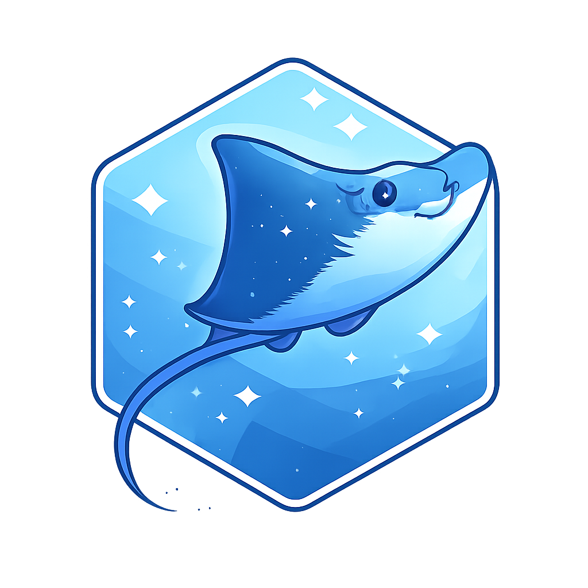

# rayevolve <a href="https://github.com/zia1138/rayevolve"></a>

Experimental project for LLM guided algorithm design and optimization built on [ray](https://www.ray.io/),
[pydantic-ai](https://github.com/pydantic/pydantic-ai), and [logfire](https://github.com/pydantic/logfire).
Originally started as an in-place fork from [ShinkaEvolve](https://github.com/SakanaAI/ShinkaEvolve).

# Installation

Clone the repo and setup a `uv` environment as follows:
```bash
git clone git@github.com:zia1138/rayevolve.git
cd rayevolve
uv sync
source .venv/bin/activate
```

Create an account and project called `rayevolve` on [logfire](https://logfire.pydantic.dev/login). 
You will need to authenticate to logfire and select the `rayevolve` project to log your runs. You can do this as follows:
```bash
logfire auth
logfire projects use rayevolve
```

This will create a file `.logfire/logfire_credentials.json` with your logfire credentials and configuration. If you
use a ray cluster, you need to make sure that this folder, in addition to rayevolve, is copied to all nodes of the cluster.

# Quickstart Instructions

You can run the circle packing example using the configs in `examples/circlepacking/config.py` with the `default` profile as follows:
```bash
rayevolve run examples/circle_packing
```
Use `rayevolve --help` to get all of the command line parameters. 

We use a a config-as-code system where you use can initialzie data classes in your projects `config.py` to modify any parameters. See the 
file [src/rayevolve/core/common.py](src/rayevolve/core/common.py)
all the configuration parameters along with a function to validate these
parameters. 

# Related Open Source Projects

Related projects use search, like rayevolve. Some also incorporate reinforcement learning (RL).

## No RL 

* [ShinkaEvolve](https://github.com/SakanaAI/ShinkaEvolve)
* [OpenEvolve](https://github.com/algorithmicsuperintelligence/openevolve)
* [LLM4AD](https://github.com/Optima-CityU/llm4ad)
* [GigaEvo](https://github.com/AIRI-Institute/gigaevo-platform/tree/main)
* [station](https://github.com/dualverse-ai/station)
* [CSE/EvoControl](https://github.com/QuantaAlpha/EvoControl)
* [autoresearch](https://github.com/karpathy/autoresearch)
* [ASI-Arch](https://github.com/GAIR-NLP/ASI-Arch)
* [GEPA](https://github.com/gepa-ai/gepa)
* [CodeEvolve](https://github.com/inter-co/science-codeevolve)

## RL Incorporated

* [ThetaEvolve](https://github.com/ypwang61/ThetaEvolve)
* [TTT-Discover](https://github.com/test-time-training/discover)


# Cluster Support

<details>
<summary>Lightning AI Studios</summary>

We provide a script [mmt_cluster.sh](mmt_cluster.sh) to launch a ray cluster on [Lightning AI Studios](https://lightning.ai) using 
[multimachine training](https://lightning.ai/docs/overview/multi-node-training/cli-commands) (MMT).

Install Lightning AI Studios SDK within the uv environment:
```bash
cd rayevolve && uv sync
source .venv/bin/activate
uv pip install lightning-sdk
```
Authenticate logfire and select rayevolve project:
```bash
logfire auth
logfire projects use rayevolve
```
Then launch an MMT cluster using the following command:
```bash
lightning run mmt --command="/teamspace/studios/this_studio/rayevolve/mmt_cluster.sh"
```
Run it on the ray cluster using 
```bash
rayevolve run examples/circle_packing --ray-ip x.x.x.x
```
where x.x.x.x is the IP address of the ray cluster head node, which you can find from the log output
on Lightning AI Studios.
